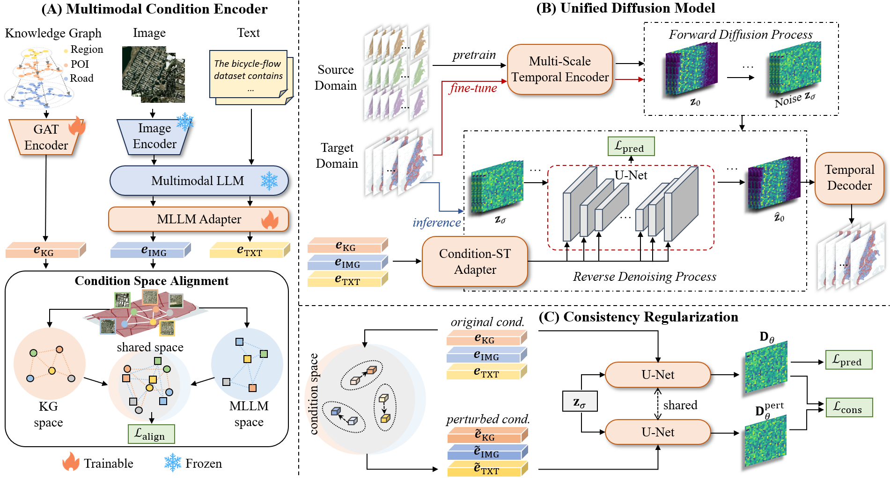

# A Universal Diffusion Model for Spatio-Temporal Data Generation

## Data Sources

Our model integrates multi-modal data including Urban Knowledge Graph, Satellite Imagery, and Spatio-Temporal data.

### Urban Knowledge Graph

We implement a specialized version of the [UUKG](https://github.com/usail-hkust/UUKG) to construct a comprehensive urban semantic network for NYC. The necessary code and data are provided in `UniDiff/UUKG_data` directory.

- **Entities:** 8 types including **Borough** (from [NYC Gov](https://www.nyc.gov/)), **Region** (from [NYC Gov](https://www.nyc.gov/)), **POI**/**Road**/**Junction** (from [OSM](https://www.openstreetmap.org/)), and  **POI**/**Road**/**Junction** **Category**(from [OSM](https://www.openstreetmap.org/)).

- **Relations:** 13 relation types covering **Geographic Containment**, **Spatial Adjacency**, and **Category**. Refer to the table below for specific details.

  | Relation                    | Head & Tail Entity  | Abbrev. | Relation                       | Head & Tail Entity | Abbrev. |
  | :-------------------------- | :------------------ | ------- | ------------------------------ | ------------------ | ------- |
  | POI Locates at Region       | (POI, Region)       | PLR     | Junction Belongs to Road       | (Junction, Road)   | JBR     |
  | Road Locates at Region      | (Road, Region)      | RLR     | Borough Nearby Borough         | (Borough, Borough) | BNB     |
  | Junction Locates at Region  | (Junction, Region)  | JLR     | Region Nearby Region           | (Region, Region)   | RNR     |
  | POI Belongs to Borough      | (POI, Borough)      | PBB     | POI Has POI Category           | (POI, PC)          | PHPC    |
  | Road Belongs to Borough     | (Road, Borough)     | RBB     | Road Has Road Category         | (Road, RC)         | RHRC    |
  | Junction Belongs to Borough | (Junction, Borough) | JBB     | Junction Has Junction Category | (Junction, JC)     | JHJC    |
  | Region Locates at Borough   | (Region, Borough)   | RLB     |                                |                    |         |

For detailed information on the UUKG construction, please refer to the original repository: https://github.com/usail-hkust/UUKG/

### Satellite Imagery

We provide example satellite imagery data in `UniDiff/ny_tiles`.  You can obtain the raw data from [ArcGIS](https://services.arcgisonline.com/arcgis/rest/services) and put it in the same directory.

### Spatio-Temporal Data

We collect and process spatio-temporal data from New York City(NYC) public datasets covering four domains, from January 1, 2024, to December 31, 2024. The four domains are: **Taxi**,  **Bike**, **Crime**, and **Service**. You can obtain the raw data via the following links and put them into `UniDiff/data` directory.

- **Taxi**：[NYC TLC](https://www.nyc.gov/site/tlc/about/tlc-trip-record-data.page)
- **Bike**：[Amason S3](https://s3.amazonaws.com/tripdata/index.html)
- **Crime**：[NYC OpenData](https://data.cityofnewyork.us/Public-Safety/NYPD-Complaint-Data-Historic/qgea-i56i)
- **Service**：[NYC OpenData](https://data.cityofnewyork.us/Social-Services/311-Service-Requests-from-2020-to-Present/erm2-nwe9)

## Pre-trained Model Weights

Our model adopts **LLaVA-7B** as the MLLM backbone with **Vicuna-7B** as the base language model. Please download the pre-trained weights and put them in the following directory:

- **Vicuna-7B:** Download [Vicuna-7B-v1.1](https://huggingface.co/lmsys/vicuna-7b-v1.1) and put it in `UniDiff/llava_cpt/`
- **LLaVA-7B:** Download [LLaVA-7B-v1](https://www.google.com/search?q=https://huggingface.co/liuhaotian/LLaVA-7b-v1) and put it in `UniDiff/llava_cpt/`

## Running Pipeline

The running process is divided into two main stages. Please ensure all data paths are correctly configured as described above.

### Step 1: MLLM Pre-training (Stage 1)

This stage focuses on aligning the multimodal large language model components.

```
python train_stage1_mllm.py
```

### Step 2: Main Diffusion Training (Stage 2)

This stage performs the universal diffusion training for spatio-temporal generation.

```
python run.py --config ./path/to/your/config_file.yaml
```
